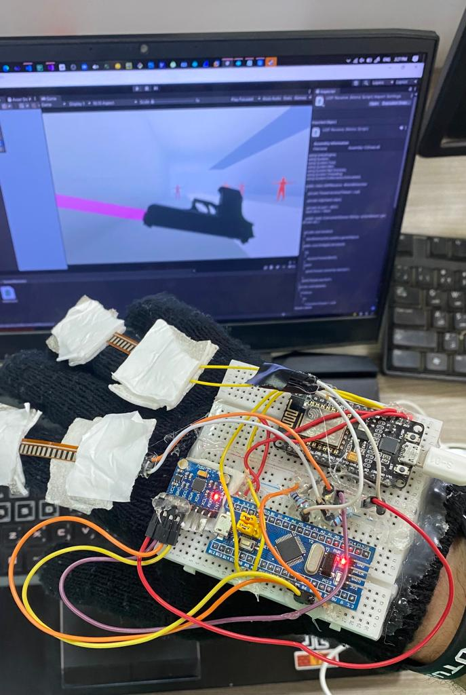

# VR-shooting

A VR unity shooting game. With the integration of a real life hand motion and fingers movement on the game using STM32 microcontroller and sending the data wirelessly using ESP8266 through UDP socket.

# Download Links

- Latest stable game build ➡ [Executatble Game](https://drive.google.com/file/d/1qrk8vEn52_JGwXJpJ8K9UbIP_1hy_aqm/view?usp=sharing)
- Latest stable unity project ➡ [Unity project](https://drive.google.com/file/d/11MGLspKIjBK62r2HWcPuZUsQUiDKZNR1/view?usp=sharing)

# Setup process

### 0 - Download latest stable unity project files.

- Latest stable unity project ➡ [Unity project](https://drive.google.com/file/d/11MGLspKIjBK62r2HWcPuZUsQUiDKZNR1/view?usp=sharing)

### 1- Flash ESP8622 Script into your ESP8266 uc. 👨‍💻

```C++
// change those values to fit your application.

#define WIFI_SSID "net1" // change this to Wifi SSID
#define WIFI_PASS "yoyoyoyo" // change to Wifi network password
#define RECEIVER_IP "255.255.255.255" // leave it as it is if the device with unity app doesn't have a static ip

#define LISTENING_UDP_PORT  8051
#define SENDING_TO_PORT     8051 // unity app receives on this post number.
```

### 2- Flash STM32 Script into your STM32 uc. 👨‍💻

```C++
#define flexPin1 PA2 // change those pins to fit your design
#define flexPin2 PA5
```

### 3- Download RiftCat + Steam + SteamVr on your PC 💻

#### - Those applications are required to stream the game on your smartphone.

[RiftCat Download](https://riftcat.com/vridge)

[Steam Download](https://store.steampowered.com/about/)

[SteamVr Download](https://store.steampowered.com/app/250820/SteamVR/)

### 4 - Download Vridg on you smart phone 📱

### 5 - Play and have fun :) ! 🕹


# Extra Images for more project visualization 🖼

<center><h2> Assembly of the project 🟩🟦🟪🟩 </h2> </center>



<center><h2> Shooting using VR hands w/o the VR headset 🔫🔫 </h2> </center>


